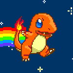

<!-- ============================= -->
<!-- ⚡  HEADER  ================== -->

  

---

<h2 align="center">🧩 My Pokémon Tech Stack 🧩</h2>

  
  
  
  
  

---

<h2 align="center">🚀 Featured Pokémon Projects 🚀</h2>

  

---

<h2 align="center">📊 Pokédex Stats 📊</h2>

  
  
  

---

<h2 align="center">🌐 Let's Connect 🌐</h2>

  
  
  
  

---

  

