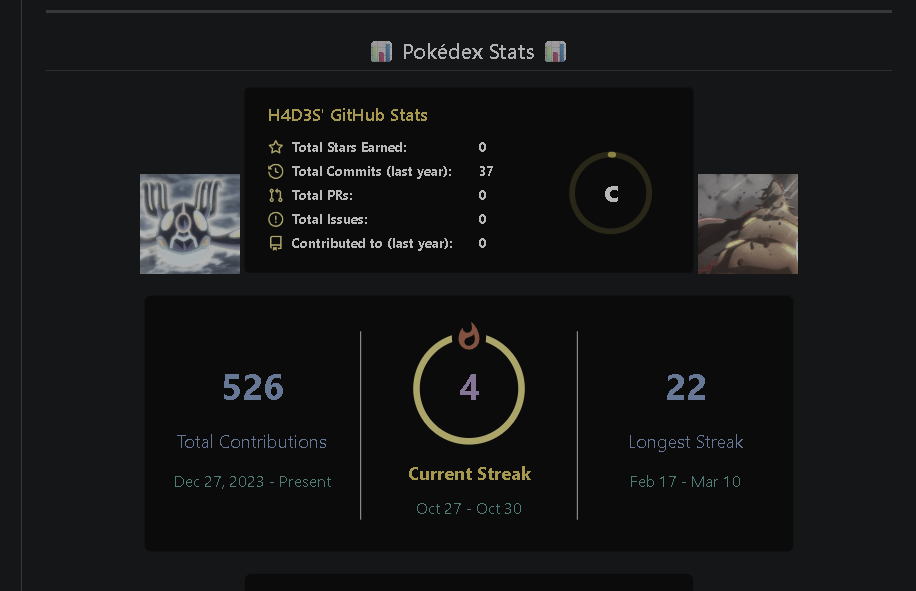
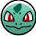
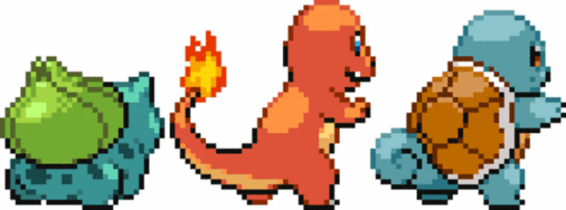

<!-- ====================================================== -->
<!-- 🌋💧 FIRE–WATER POKÉDEX README for H4D3S21 -->

  <!-- 🔝 Top Animated Border -->
  

  <!-- ======================= -->
  <!-- ⚡ HEADER -->
  

    
  

  <!-- 🔥💧 Divider -->
  

  <!-- ======================= -->
  <!-- 🎮 SKILLS SECTION -->
  <h2 align="center">⚔️ Trainer Skills</h2>

  

    <table>
      <tr>
        <td align="center">
           
          <b style="color:#dba61c;">⚡ Python</b>
        </td>
        <td align="center">
           
          <b style="color:#49c4ff;">🌪️ SQL / DBMS</b>
        </td>
      </tr>
      <tr>
        <td align="center">
           
          <b style="color:#60e660;">🧠 ML Enthusiast</b>
        </td>
        <td align="center">
           
          <b style="color:#f78fb3;">🛡️ Cyber Security</b>
        </td>
      </tr>
    </table>
  

  <!-- 🔥💧 Divider -->
  

<!-- ======================= -->
<!-- 📟 POKÉDEX STATS SECTION -->
<h2 align="center">📟 Pokédex Stats</h2>

  <!-- Pokédex Background -->
  

<!-- ======================= -->
<!-- 📟 POKÉDEX STATS SECTION -->
<h2 align="center">📟 Pokédex Stats</h2>

  <!-- 🔲 Pokédex Background (Darkened for Realistic Depth) -->
  

  <!-- 🧠 Dynamic GitHub Stats Cards (Visually Aligned Inside the Left Screen) -->
  

  <table>
    <tr>
      <td align="center" width="400">
        
      </td>
      <td align="center" width="400">
        
      </td>
    </tr>
  </table>

  

  <!-- ======================= -->
  <!-- 📬 SOCIALS SECTION -->
  <h2 align="center">🔗 Connect with Me</h2>

  

    <table>
      <tr>
        <td align="center">
           <b>🐭 GitHub</b>
        </td>
        <td align="center">
           <b>🔥 LinkedIn</b>
        </td>
        <td align="center">
           <b>🌿 Twitter</b>
        </td>
        <td align="center">
           <b>💧 Portfolio</b>
        </td>
      </tr>
    </table>
  

  <!-- 🔻 Bottom Divider -->
  

  <!-- ======================= -->
  <!-- 🌊 FOOTER -->
  

    
  

  <!-- 🔻 Bottom Border -->
  

