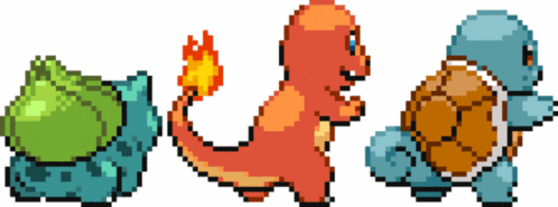

<!-- ============================= -->
<!-- ⚡ HEADER ==================== -->

  

---

<h2 align="center">🧩 My Pokémon Tech Stack 🧩</h2>

   
  <b>⚡ Python ⚡</b>

   
  <b>💾 SQL / DBMS 💾</b>

   
  <b>🤖 ML Enthusiast 🤖</b>

   
  <b>🔐 Cybersecurity Learner 🔐</b>

   
  <b>🔥 Java (Intermediate) 🔥</b>

---

<!-- 🔥💧 Fire–Water Divider -->

  

---

<h2 align="center">📊 Pokédex Stats 📊</h2>

  

    
    
    
  

  

    
  

  

    
  

---

<h2 align="center">🌐 Let's Connect 🌐</h2>

  
  
  
  

---

  

